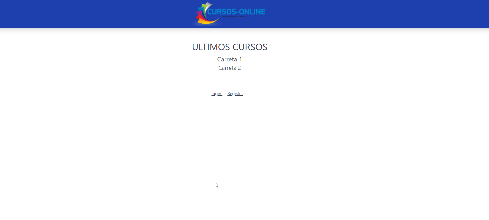
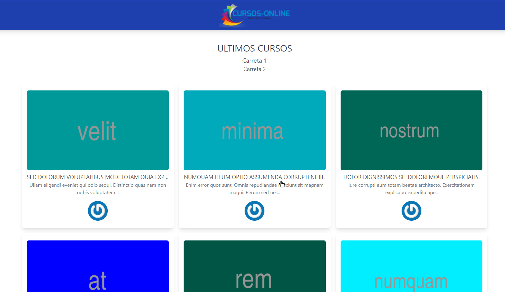

# Curso introduccion a laravel 8


Instalacion laravel
```shell
composer create-project --prefer-dist laravel/laravel lw-blade
```

Instalacion jetstream
```shell
composer require laravel/jetstream

php artisan jetstream:install livewire
```

Ejecutar
```shell
npm install && npm run dev
```


Ejecutar migraciones

```shell
php artisan migrate

php artisan migrate:rollback

php artisan migrate:fresh --seed
```


Seguimiento a la fase 1




Creando Componente
```shell
php artisan make:livewire CourseList
```

Seguimiento a la fase 2


